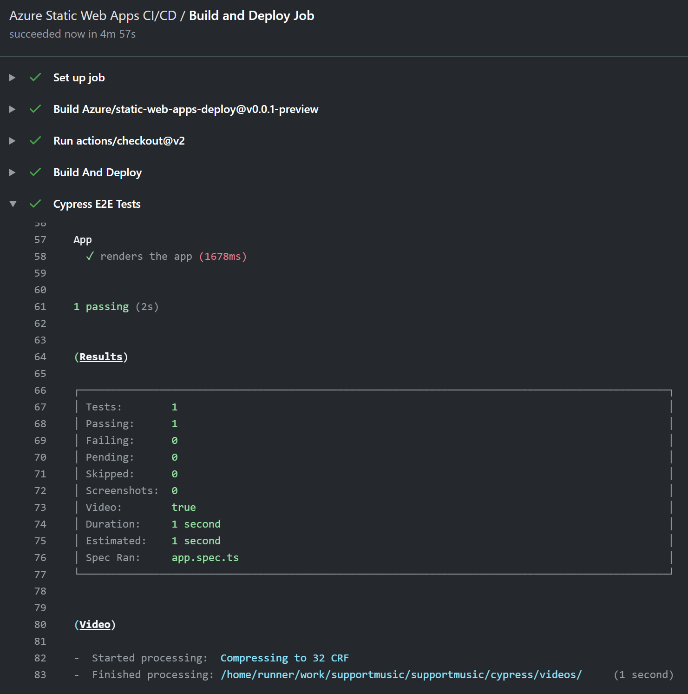
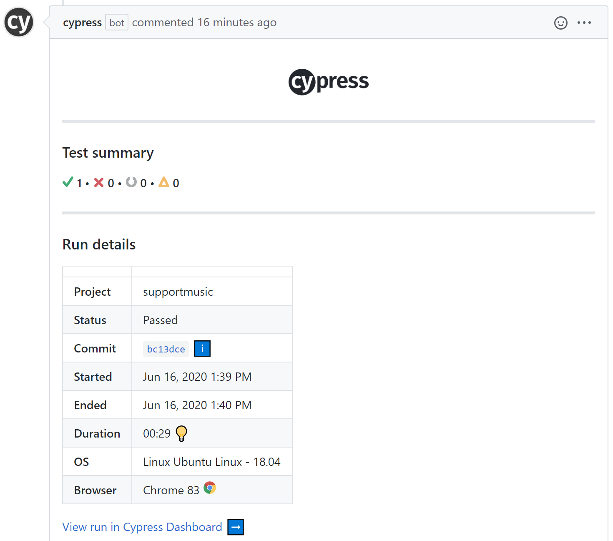
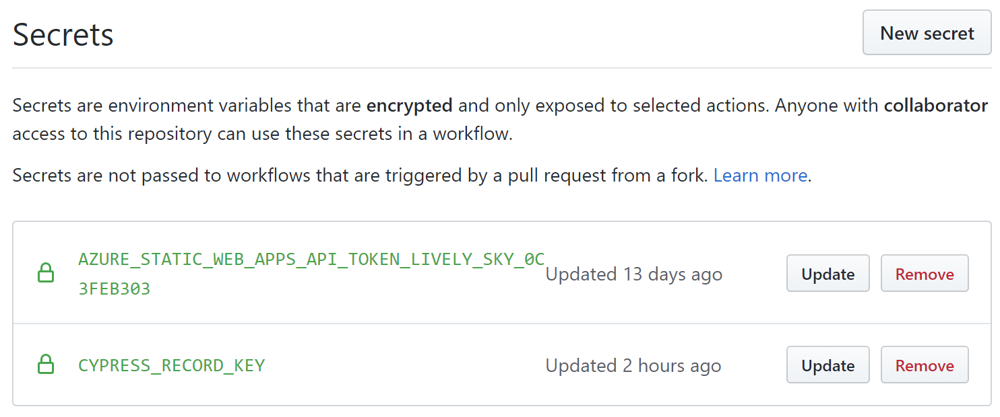
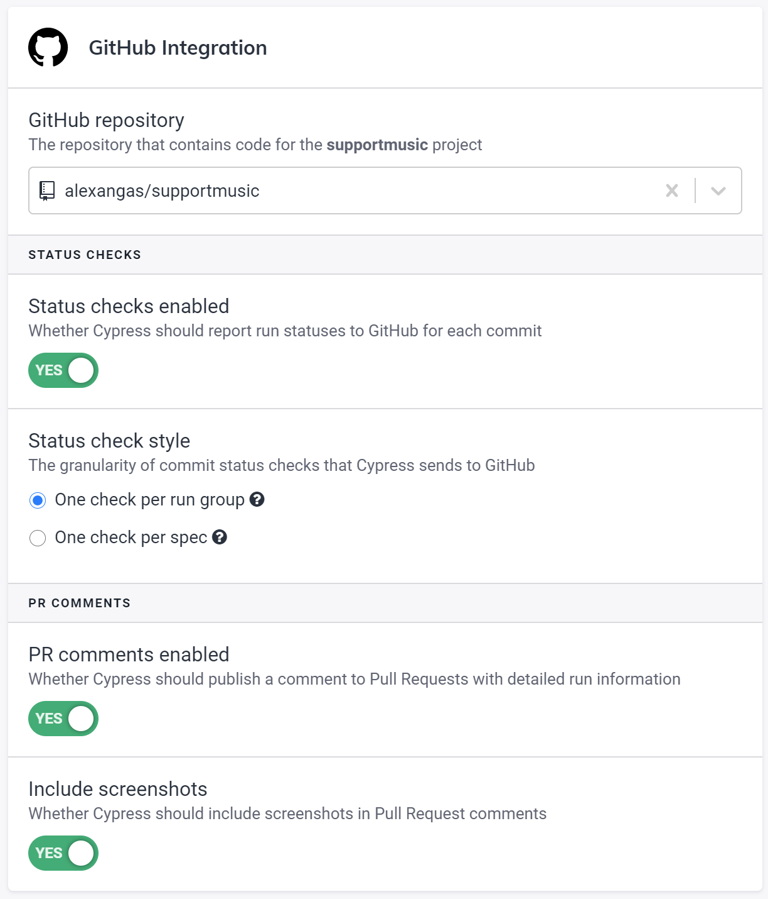

[Cypress](https://cypress.io) is a popular end-to-end testing framework that provides good [support for CI/CD pipelines](https://docs.cypress.io/guides/guides/continuous-integration.html).
This process typically works with a build agent command that performs a build, in conjunction with starting up a basic dev server such as [start-server-and-test](https://www.npmjs.com/package/start-server-and-test).
Cypress is then run against it.

With [Azure Static Web Apps](https://docs.microsoft.com/azure/static-web-apps/), we already have the concept of [pre-production or "staging" environments](https://docs.microsoft.com/azure/static-web-apps/review-publish-pull-requests).
When a pull request is created, so is the staging environment.
Each commit causes a build and re-deploy.
So as we already have this environment, why don't we both save time in our build pipeline as well as get a more accurate result by running Cypress against the site as it is hosted in Azure?
Here's how we go about it!

## Adding the Cypress GitHub Action

Assuming you already have an Azure Static Web App created, you may already be aware of the GitHub workflow it provides which manages the build and environment deployments.
For example, in my site with URL **lively-sky-0c3feb303.azurestaticapps.net**, this file is located under [.github/workflows/azure-static-web-apps-lively-sky-0c3feb303.yml](https://github.com/alexangas/supportmusic/blob/50ad28b2a18f3cc691e046e36e196bb151afed01/.github/workflows/azure-static-web-apps-lively-sky-0c3feb303.yml) (note: this is a link to the original version before any modification).
Open this file for editing, and make note of the `build_and_deploy_job` job.
We will add the [Cypress GitHub Action](https://github.com/cypress-io/github-action) as another step to the end of this job, like this:

```yaml
- name: Cypress E2E Tests
  uses: cypress-io/github-action@v1
  env:
    CYPRESS_BASE_URL: https://lively-sky-0c3feb303-${{ github.event.pull_request.number }}.westeurope.azurestaticapps.net
```

The important ingredient here is the use of `github.event.pull_request.number`.
As you may already be aware, the staging environment created by Azure Static Web Apps has a format very similar to the URL of the production environment.
That is, the subdomain hosting the app is suffixed with a hyphen followed by the pull request number, and the next segment of the domain specifies the region name.
So for example, the live URL `lively-sky-0c3feb303.azurestaticapps.net` produces a staging URL that looks like `lively-sky-0c3feb303-33.westeurope.azurestaticapps.net` (depending on PR number and hosting region).
We dynamically adjust the base URL by overriding it with Cypress environment variable `CYPRESS_BASE_URL`.
As the staging environment is publically accessible, we can point Cypress at it with no restrictions.

You might have noticed a little problem here, however!
This is all going to work fine for a pull request, but what about when the workflow is triggered by a branch push (as would happen when this change is merged)?
The staging environment will no longer exist, and the Cypress tests will fail!
To get around this, we can initialize the URL to be used for testing with a Bash script.
We start by defaulting to the live URL, but if the pull request number is available the value is overridden with that of the staging environment URL.
With this addition, the job now ends with:

```yaml
- name: Initialize test variables
  shell: bash
  run: |
    CYPRESS_BASE_URL="https://lively-sky-0c3feb303.azurestaticapps.net"
    if [ -n "${{ github.event.pull_request.number }}" ]; then CYPRESS_BASE_URL="https://lively-sky-0c3feb303-${{ github.event.pull_request.number }}.westeurope.azurestaticapps.net" ; fi
    echo "::set-env name=CYPRESS_BASE_URL::${CYPRESS_BASE_URL}"
- name: Cypress E2E Tests
  uses: cypress-io/github-action@v1
```

Now whenever the pipeline runs, whether over a pull request or the default branch, so do our Cypress tests!



## Recording test runs on the Cypress Dashboard

We're now going to use the Cypress GitHub Action to enable integration between GitHub and the [Cypress Dashboard](https://www.cypress.io/dashboard/).
This will provide an easy-to-use interface for your quality and test team to review, as well as greatly enhance our project's pull request experience!



I'm assuming that you have already created a project in Cypress Dashboard and linked it to your GitHub account.
(From memory I did this by logging into [Dashboard](https://dashboard.cypress.io/) with my GitHub account, and must have installed it as a GitHub App - I can't exactly recall!)

Now, to ensure that only runs from trusted pipelines are recorded, a Record Key needs to be created.
The relevant area in Dashboard project settings looks like this:

Click **Create New Key** and then click the copy button next to the generated key.
Do not give this key value to anyone else.
 
You now need to go to your project's GitHub Settings and click on Secrets.
(Notice that the Azure Static Web Apps API token that allows your GitHub workflow to upload build assets is here!) 

Click **New secret**, for *Name* enter `CYPRESS_RECORD_KEY`, then paste the value of the record key generated from Cypress Dashboard, and click **Add secret**.  

We can now instruct the GitHub action to record the test run, and specify the record key to use via the `CYPRESS_RECORD_KEY` environment variable.
It's super simple... our GitHub Action step now looks like this:

```yaml
- name: Cypress E2E Tests
  uses: cypress-io/github-action@v1
  env:
    CYPRESS_RECORD_KEY: ${{ secrets.CYPRESS_RECORD_KEY }}
  with:
    record: true
```

We will now get test runs recorded in the Cypress Dashboard!
However there's one more step to get that nice pull request experience, and that's to ensure the **GitHub Integration** section of project settings is populated.


I recommend taking a look at what's possible with the [Cypress GitHub Action](https://github.com/cypress-io/github-action) as there are some handy things it provides.
For example, you can very easily switch the browser used for testing, and upload generated screenshot and video artifacts from the test run.

Enjoy using the Cypress GitHub Action with Azure Static Web Apps!
